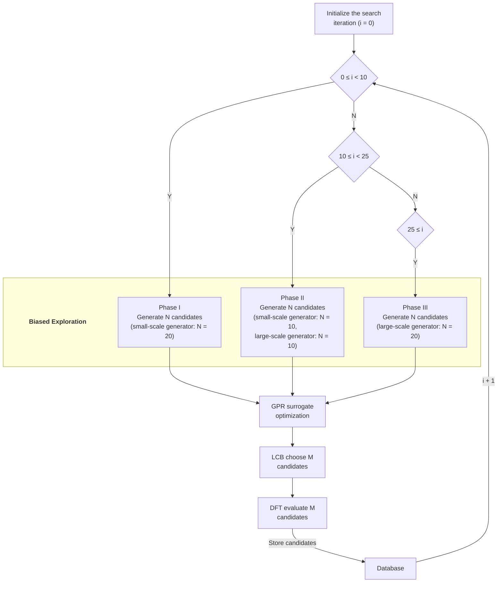

# 01 — Methods

<!-- DRAFT v3 · section 01 of the manuscript (markdown-first, pre-LaTeX)
     Grounded in CLAIMS.md v1 (signed off). Citations verified and in references.bib
     (Phase D done for this section). -->

## 1.1 Interface models

We study the metal-on-oxide interface relevant to magnetic tunnel junctions: a thin
metal film deposited on the MgO(001) surface. Four compositions were considered, differing
in the film constitution:

| Model | Composition | Film species | N atoms |
|-------|-------------|--------------|---------|
| Fe/MgO | Fe₂₅Mg₂₅O₂₅ | Fe | 75 |
| Fe-B/MgO | B₃Fe₂₅Mg₂₅O₂₅ | Fe + B | 78 |
| Fe-Co/MgO | Co₇Fe₁₈Mg₂₅O₂₅ | Fe + Co | 75 |
| Fe-Co-B/MgO | B₂Co₇Fe₁₈Mg₂₅O₂₅ | Fe + Co + B | 77 |

The substrate is a single MgO(001) layer and the film a single
metal layer, stacked along z with 20 Å of vacuum and periodic boundaries in-plane
(`pbc = [True, True, False]`). The in-plane lattice was matched by a √2 rotation of the
MgO cell (a_MgO/√2 = 2.978 Å) to the optimized Fe lattice (a_Fe = 2.870 Å), giving a **3.77 %**
compressive/tensile mismatch; the substrate was held fixed and only the film was allowed
to relax. A (5×5×1) in-plane supercell was used throughout.

## 1.2 Biased global optimisation (AGOX / GOFEE)

Structures were sampled with AGOX \cite{agox2020}, using a **GOFEE**-type surrogate-driven
search \cite{gofee2017}: a Gaussian-process regression (GPR) surrogate with an Oganov-type
fingerprint descriptor \cite{oganov2011} and a repulsive prior, coupled to a
lower-confidence-bound (LCB) acquisition function (κ = 2). Each search ran 100 iterations.

**Three-phase biased exploration.** Candidate generation is not uniform over the run but
proceeds in three phases selected by the iteration counter *i*, mixing two generators of
different perturbation scale: a **small-scale** generator (heterostructure-aware
randomiser, rattle amplitude 1.5) and a **large-scale** generator (rattle generator,
amplitude 2.3). The schedule is:

| Phase | Iterations | Small-scale | Large-scale | Total N |
|-------|-----------|-------------|-------------|---------|
| **I** | 0 ≤ i < 10 | 20 | 0 | 20 |
| **II** | 10 ≤ i < 25 | 10 | 10 | 20 |
| **III** | 25 ≤ i | 0 | 20 | 20 |

Each phase generates N candidates, which are optimised against the GPR surrogate, ranked
by the LCB acquisition, and the M selected candidates are evaluated with DFT and stored in
the database; the iteration counter advances and the phase is re-selected. The early phases
favour the small-scale (structure-aware) generator to explore the flat reference basin,
while the later phase shifts to the large-scale rattle generator for broader exploration.

**Bias.** The exploration is deliberately **biased**: the search is seeded from a **flat**
metal layer (the reference film geometry) rather than a random configuration, so the sampled
database is a mixture of the flat (registry-locked) basin and any lower-lying basin the
search finds. Each model was run from multiple independent random seeds
(13 / 7 / 5 / 4 for the four models); each seed constitutes one independent search.

Candidates were relaxed by the surrogate model for up to 100 steps (starting from
iteration 10) and evaluated with the DFT calculator below. **Only structures from
iteration ≥ 10 were used in the analysis**, i.e. after relaxation had begun; earlier
pre-relaxation placements were discarded.

## 1.3 DFT settings

Energies and forces were obtained with GPAW \cite{gpaw2014} in LCAO mode (double-zeta
polarised basis, `dzp`), the PBE exchange–correlation functional \cite{pbe1996}, a
(1×1×1) k-point mesh, Fermi–Dirac smearing (width 0.05 eV), and spin polarisation with
Hund's rule coupling enabled; a Pulay mixer and a fixed convergence criterion
(energy 10⁻⁴ eV, density/eigenstates 10⁻³) were used throughout. Note the deliberately
modest computational setup (single-layer slab, Γ-point sampling): the study targets
**trends across compositions**, not converged absolute energies (see §1.6).

## 1.4 Flatness and energy metrics

Two quantities describe each sampled structure:

**Film flatness ΔZ** — the vertical span of the metal film,
ΔZ = z(metal)_max − z(metal)_min, taken over all film atoms (Fe and Co). ΔZ ≈ 0 is a flat,
wetting film; large ΔZ is a 3D island (dewetted). A threshold of ΔZ ≤ 1.0 Å separates the
"flat" and "island" basins.

**Relative energy dE/N** — the per-atom energy above the system's global minimum,
dE/N = (E − E_min)/N, where E_min is the lowest energy found for that composition and N
the atom count. By construction the global minimum is 0 eV/atom; per-atom normalisation
makes the four models directly comparable despite their differing atom counts.

For each model, the **flat-basin ground state** (lowest dE/N among ΔZ ≤ 1.0 Å structures)
was compared against the overall minimum, isolating the energy penalty of the flat
configuration.

## 1.5 Robustness of the method

Because the search relies on a biased-exploration scheme, three method parameters were
varied on the Fe/MgO model to test robustness (Supplementary Material): the rattle
strength, the LCB parameter κ, and the inclusion of a dipole correction. The principal
conclusion was shown to be insensitive to κ and to the dipole correction, and to degrade
only when the rattle strength was reduced.

## 1.6 Scope and limitations

The structures retained here are **not DFT-converged minima**: candidates were relaxed
with the surrogate model and evaluated with a single DFT step, leaving residual forces of
order 1–2 eV/Å. Accordingly, "lowest energy" and "basin" denote the lowest DFT energy
*encountered* in the search, not a converged minimum, and the results are interpreted
qualitatively (trends across compositions). The flat configuration is therefore described
as a *higher-energy flat basin*, not as a metastable state — establishing metastability
would require converged relaxations, a Hessian (no imaginary modes) and a barrier between
basins. A full re-relaxation of representative structures is prepared for this purpose.
