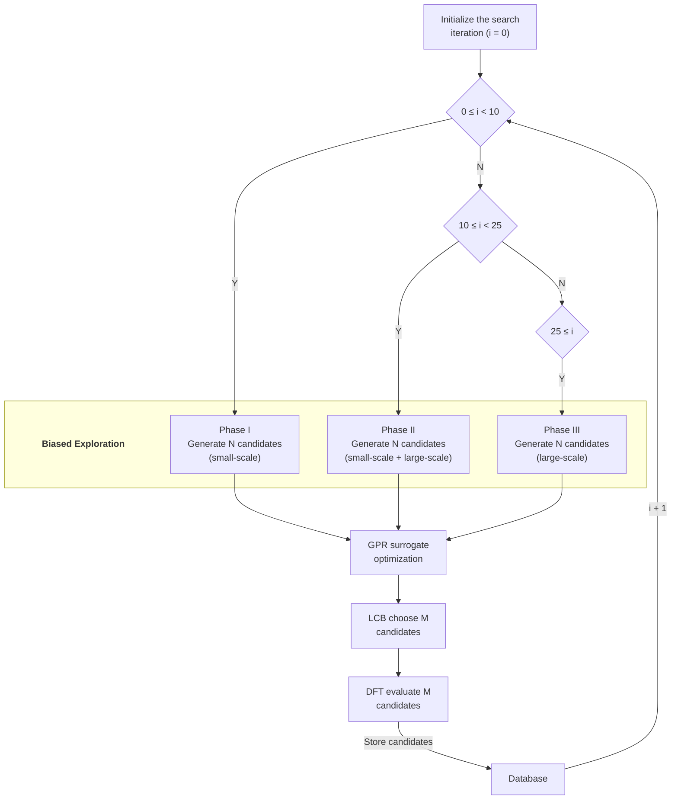

# 01 — Methods
     v7 (2026-09-18): editorial pass requested by the scientist — the bold-lead paragraphs
     ("Three-phase biased exploration.", "Bias.", "Only completed searches are used.") are now
     sub-sub headings, and all mid-paragraph bold emphasis is removed (the §1.4 metric definitions
     keep their lead terms as plain text). No number or claim changed. **APPROVAL VOIDED** by this
     edit (v6 was approved 2026-09-18); re-approval pending.
     v6 (2026-09-17): the excluded searches are described in prose (iteration reached, structures
     missing) instead of by directory name, and the selection rule is no longer referred to by its
     filename. APPROVED 2026-09-18.

     v5 (2026-09-17): re-scoped to the Fe host (CLAIMS v9) — the two Co-containing models, their
     generator schedule (former Table 3) and their excluded runs are out of the paper. Float
     renumbering follows: the Results tables become Tables 3 and 4. TO BE RE-APPROVED — no prior
     approval survives this edit.

<!-- DRAFT v6 · section 01 of the manuscript (markdown-first, pre-LaTeX)
     Grounded in CLAIMS.md v9 (scope: Fe/MgO + Fe-B/MgO). Citations verified and in references.bib
     (Phase D done for this section). -->
<!-- v4 (2026-09-17): §1.2 gained the completed-search rule and the list of excluded runs (then
     13 / 6 / 4 / 3).
     v3 (2026-09-17): exploration schedule stated per model (§1.2) — Fe-Co used a third,
     species-permutation generator; seed count corrected 7 -> 6; reference-layer composition
     spelled out. The per-model schedule and the Fe-Co generator are archived as of v5. -->

## 1.1 Interface models

We study the metal-on-oxide interface relevant to magnetic tunnel junctions: a thin
metal film deposited on the MgO(001) surface. Two compositions were considered, differing only in
whether boron is present in the film (Table 1) — the pair that isolates the effect of the added
metalloid in a single host.

**Table 1.** The two interface models: film constitution and total atom count.

| Model | Composition | Film species | N atoms |
|-------|-------------|--------------|---------|
| Fe/MgO | Fe₂₅Mg₂₅O₂₅ | Fe | 75 |
| Fe-B/MgO | B₃Fe₂₅Mg₂₅O₂₅ | Fe + B | 78 |

The substrate is a single MgO(001) layer and the film a single
metal layer, stacked along z with 20 Å of vacuum and periodic boundaries in-plane. The
in-plane lattice of the simulation cell is the DFT-optimised Fe lattice constant
(a_Fe = 2.870 Å), used in a (5×5×1) supercell throughout. The MgO layer is built epitaxially
onto that geometry: the substrate is assembled on the Fe(001) surface cell with the oxygen
sublattice placed directly above the metal sites (a √2 rotation relative to the bulk MgO cell),
so the MgO in-plane parameter is forced to 2.870 Å. Compared with the bulk value
(a_MgO/√2 = 2.978 Å) this means the MgO is compressed in-plane by 3.6 %, i.e. the mismatch is accommodated by the substrate,
not by the film — the Fe film remains at its own equilibrium lattice constant and is not
strained in-plane. The substrate is then held fixed in that compressed state and only the
film is allowed to relax.

## 1.2 Biased global optimisation (AGOX / GOFEE)

Structures were sampled with AGOX \cite{agox2020}, using a GOFEE-type surrogate-driven
search \cite{gofee2017}: a Gaussian-process regression (GPR) surrogate with an Oganov-type
fingerprint descriptor \cite{oganov2011} and a repulsive prior, coupled to a
lower-confidence-bound (LCB) acquisition function (κ = 2). Each search ran 100 iterations.

### Three-phase biased exploration

Candidate generation is not uniform over the run but
proceeds in three phases selected by the iteration counter *i*, mixing generators of different
perturbation scale. Both models combine a small-scale heterostructure-aware randomiser
(rattle amplitude 1.5, all film atoms) with a large-scale rattle generator (half the film
atoms, rattle amplitude 2.3); the schedule is identical for the two models and is given in
Table 2.

**Table 2.** Candidate-generation schedule, common to both models: a small-scale
heterostructure-aware randomiser and a large-scale rattle generator. The number of candidates
generated per phase is N.

| Phase | Iterations | Small-scale | Large-scale | Total N |
|-------|-----------|-------------|-------------|---------|
| **I** | 0 ≤ i < 10 | 20 | 0 | 20 |
| **II** | 10 ≤ i < 25 | 10 | 10 | 20 |
| **III** | 25 ≤ i | 0 | 20 | 20 |

The per-phase candidate total is 20; the two models differ only in whether the film contains
boron, not in how candidates are generated. The resulting workflow is summarised in Fig. 1.

**Figure 1.** The biased-exploration loop. Each iteration selects a phase from the counter *i*,
generates N candidates with that phase's generator mix (Table 2), optimises them against
the GPR surrogate, ranks them with the LCB acquisition, evaluates the selected candidates with
DFT and stores them in the database; the counter then advances and the phase is re-selected.

The early phases favour the small-scale (structure-aware) generator, which preserves the
layer-resolved character of the flat reference basin, while the later phases shift to the
large-scale rattle generator for broader exploration.

### Bias

The exploration is deliberately biased: the search is seeded from a flat
metal layer — the reference film geometry, a single-monolayer-thick film rather than a random
three-dimensional distribution of metal atoms — so the sampled database is a mixture of the
flat basin and any lower-lying basin the search finds. The composition of the reference layer
follows the target stoichiometry (§1.1): a pure Fe layer for Fe/MgO, and the same Fe layer with B
added above the surface for Fe-B/MgO. The films are single-layer in both models, and the two
reference layers differ only by the boron. Each model was run from multiple independent random
seeds, and each seed constitutes one independent search.

### Only completed searches are used

Every number in this paper comes from searches that ran the
full 100-iteration budget: 13 completed searches for Fe/MgO and 6 for Fe-B/MgO, 19 in total.
Two further searches were started and are *not* used, and we record them here rather than drop them
silently — one Fe/MgO search reached only iteration 37, and one Fe-B/MgO search produced no stored
structures at all. A stopped search has had less search time than a completed one, so its best energy
is systematically worse; and because such searches are not distributed evenly across the two models,
including them would bias the comparison between them — as the method-parameter study in the
Supplementary Material also shows, where searches that stopped early inflate the mean of one setting
and depress another (§S3). The same criterion is applied without exception throughout the analysis,
and it is decided from the iteration count recorded for each search, not from how a search is
labelled: a search that looks complete can have stopped early, and one whose stored structures are
missing is treated the same way. In the two models used here the excluded searches happen to be
identifiable at a glance; the rule does not rely on that.

Candidates were relaxed by the surrogate model for up to 100 steps (starting from
iteration 10) and evaluated with the DFT calculator below. Only structures from
iteration ≥ 10 were used in the analysis, i.e. after relaxation had begun; earlier
pre-relaxation placements were discarded.

## 1.3 DFT settings

Energies and forces were obtained with GPAW \cite{gpaw2014} in LCAO mode (double-zeta
polarised basis), the PBE exchange–correlation functional \cite{pbe1996}, a
(1×1×1) k-point mesh, Fermi–Dirac smearing (width 0.05 eV), and spin polarisation with
Hund's rule coupling enabled; a Pulay mixer and a fixed convergence criterion
(energy 10⁻⁴ eV, density/eigenstates 10⁻³) were used throughout. Note the deliberately
modest computational setup (single-layer slab, Γ-point sampling): the study targets
trends across compositions, not converged absolute energies (see §1.6).

The interfacial Fe–O separation is a construction parameter rather than a computed
quantity: the reference films are built with the first oxygen layer of the substrate 2.3 Å
above the metal plane, and relaxation preserves that spacing (2.300 Å for the flat basin, i.e.
unchanged to the printed precision, and 2.331 Å for the island). Comparison with the 2.0–2.3 Å
range reported for this interface by LEED analyses and earlier calculations
\cite{urano1988,butler2001} therefore checks the model construction rather than testing the
electronic-structure method. Independent of this, the LCAO basis set is appreciably less
complete than a plane-wave or real-space representation \cite{larsen2009}, so absolute
geometric parameters are reported at fixed settings and are not interpreted as converged
values.

## 1.4 Flatness and energy metrics

Two quantities describe each sampled structure:

Film flatness ΔZ — the vertical span of the metal film,
ΔZ = z(metal)_max − z(metal)_min, taken over the film's metal atoms (Fe; boron is a
metalloid and is not part of the flatness metric). ΔZ ≈ 0 is a flat, wetting film; large ΔZ is a
3D island (dewetted). A threshold of ΔZ ≤ 1.0 Å separates the "flat" and "island" basins.

Relative energy dE/N — the per-atom energy above the system's global minimum,
dE/N = (E − E_min)/N, where E_min is the lowest energy found for that composition and N
the atom count. By construction the global minimum is 0 eV/atom; per-atom normalisation makes the
two models directly comparable despite their differing atom counts (75 and 78 atoms).

For each model, the flat-basin ground state (lowest dE/N among ΔZ ≤ 1.0 Å structures)
was compared against the overall minimum, isolating the energy penalty of the flat
configuration.

## 1.5 Robustness of the method

Because the search relies on a biased-exploration scheme, three method parameters were
varied on the Fe/MgO model to test robustness (Supplementary Material): the rattle
strength, the LCB parameter κ, and the inclusion of a dipole correction. The principal
conclusion was shown to be insensitive to κ and to the dipole correction, and to degrade
only when the rattle strength was reduced. This is the same model, method and reference layer as
the Fe/MgO results of §2, so the study bounds the method used for the two models reported here.

## 1.6 Scope and limitations

The structures retained here are not DFT-converged minima: candidates were relaxed
with the surrogate model and evaluated with a single DFT step, leaving residual forces of
order 1–2 eV/Å. Accordingly, "lowest energy" and "basin" denote the lowest DFT energy
*encountered* in the search, not a converged minimum, and the results are interpreted
qualitatively (trends across compositions). The flat configuration is therefore described
as a *higher-energy flat basin*, not as a metastable state — establishing metastability
would require converged relaxations, a Hessian (no imaginary modes) and a barrier between
basins. A full re-relaxation of representative structures is necessary for this purpose.

The models additionally build both phases on a body-centred-cubic Fe lattice, whereas the
experimentally reported structure of ultrathin Fe on MgO(001) is body-centred tetragonal
below about 10 Å, changing to bcc only above that thickness \cite{urano1988}. The island branch
spans ΔZ ≈ 1–6 Å, so the structures compared here lie in the thickness regime in which the
experimental film is not bcc. The flat–island comparison should therefore be read as a trend
obtained within a fixed lattice model, not as a prediction of absolute structural parameters.

One further property of the model bounds its interpretation: the strain convention is the
inverse of the experimental stack. The simulation cell takes the Fe lattice constant and the
substrate is compressed to match it, so the Fe film is unstrained in-plane, whereas in a real
junction a thin Fe film on bulk MgO absorbs the mismatch as in-plane strain and relieves it
through interfacial dislocations. This model therefore does not represent the strained-film
situation (see §3.4). The convention is the same for both models reported here, so it does not
enter the Fe/MgO-vs-Fe-B/MgO comparison at all.

Finally, the two models differ *only* by the added boron: both are built on the same lattice
constant, the same substrate, the same reference-layer geometry and the same candidate-generation
schedule. What the comparison cannot separate is boron from *any* added element — a second,
chemically different film composition would be needed for that, and none is analysed here.
