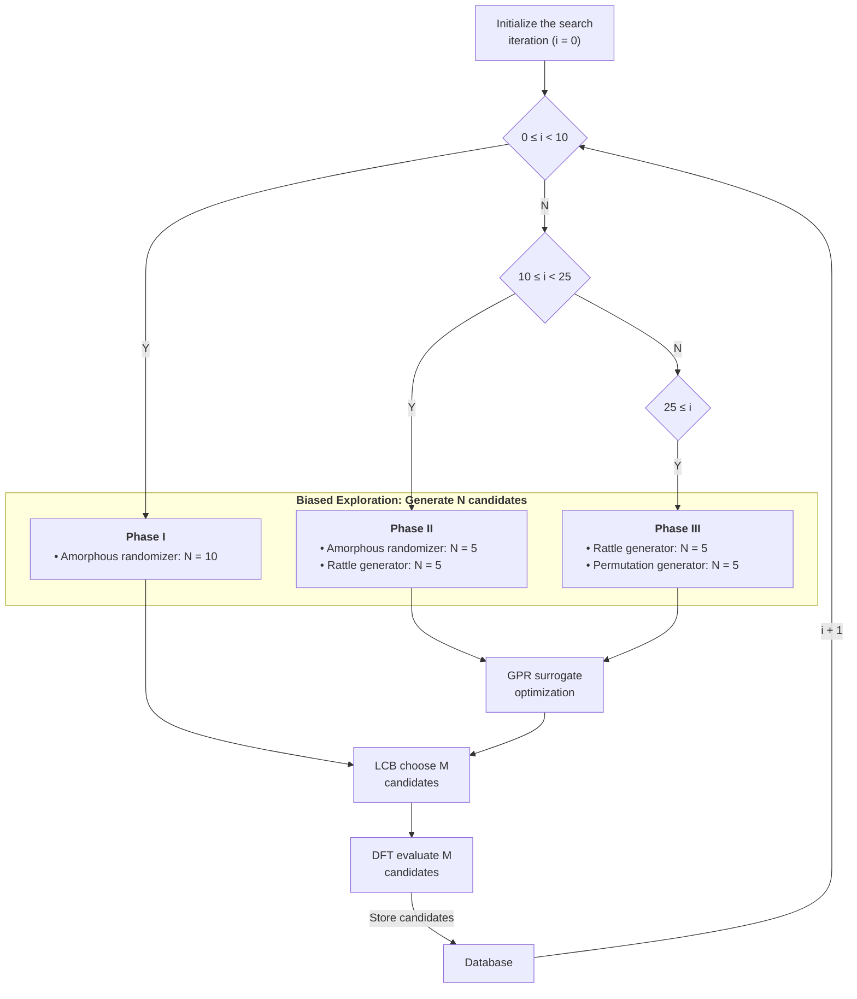

# CLAIMS.md — paper1 (frozen claim list)

Freeze the claims before drafting. Any new claim requires bumping this file to v3 first. Numbers must trace to a source file; figures/results come from `analysis/` by reference. **v3 adds the Method claims (M-1..M-2, M-1b..M-1d); the manuscript and the mermaid flowchart (M-1b) must trace to them.**

## One-sentence contribution — CONFIRMED (owner, Session 4; reframed Session 4b/4c/4d; **reference-dependence reframe Session 4t**)
We present a cheap, **reference-dependent** route to model amorphous alloys: a GOFEE/AGOX global-optimization screening (Oganov-style fingerprint descriptor) enumerates the low-energy amorphous basin around a chosen crystalline reference, and the Steinhardt q6 crystalline-fraction order parameter confirms amorphization. Applied to Pt(P) — whose fcc reference is its only stable phase — the screening finds 20–30 at% P as the onset of structural amorphization, saturating in concentration and modestly increasing under +3/+5% cell expansion. The reference-dependence is the key feature: for polymorphic hosts (Ta, W) the reference state is a physical choice, and we demonstrate the method from the **α (bcc) reference** while experiments stabilize the metastable **β** phase (SI-1).

> Scope decision (owner, Session 4t): **FLAPW SHC is dropped entirely from the paper** — the contribution is the cheap, reference-dependent screening → structural verification pipeline. No SHC claims are made.
>
> Experimental anchoring (owner-approved, Session 4b): Shashank et al. 2025 (\cite{shashank2025}) is the experimental anchor — it demonstrates that *amorphous Pt(P) is achievable* and that amorphization is energy/dose (hence composition) dependent. Our 20–30 at% P is framed as the **onset regime** of the interstitial global-optimization route, **not** an absolute experimental P threshold.

## Main-text claims (MT)

### MT-1 — P loading drives the ONSET of structural amorphization (0P → 20/30P)
- **Claim:** Adding P interstitials (20–30 at%) collapses the host crystalline fraction from 0.87–0.97 to 0.11–0.20, i.e. 20–30 at% marks the onset of structural amorphization by the interstitial global-optimization route.
- **Evidence:** Steinhardt q6 crystalline-fraction (fraction of atoms with q6 > 0.5), per-leaf mean over AGOX `iteration >= 10` structures within 0.3 eV/atom of the leaf's global minimum (e_max cap, per M-2): 0P 0.874–0.965 → 20P/30P 0.112–0.200, across all three cell families. Cross-checked by XRD integrated CI (0.81–0.83 → 0.35–0.38, `data/17_PPt/DISCUSSION.md`). *(method: Steinhardt q6 + e_max cap per M-2; iteration ≥ 10 filter per M-1.)*
- **Framing:** "onset" of amorphization, not an absolute experimental P threshold — our concentration (20–30 at%) will be reported alongside the experimental anchor (Shashank: thermodynamic/transport onset by ion dose+energy; box-model dose→at% maps ~35–66 at%, see Limitations).
- **Mechanism:** P is a second species at off-stoichiometric load; per the confusion principle \cite{greer1993}, each added species frustrates the fcc packing of the host, favouring glass/amorphous formation — the physical driver behind the observed 0P→20/30P collapse. Concentration saturation (MT-2) follows once this topological frustration saturates.
- **Source:** `analysis/cna_rdf/*/cna_rdf.json` (crystalline_fraction.mean); XRD table in `data/17_PPt/DISCUSSION.md`; \cite{shashank2025,greer1993}.
- **Verified:** yes.

### MT-2 — Amorphization saturates with concentration (20P ≈ 30P)
- **Claim:** 20% vs 30% P give indistinguishable crystalline fraction (0.112–0.200), i.e. the amorphizing effect saturates once P is loaded.
- **Evidence:** 20P vs 30P crystalline fractions overlap within scatter at every cell (+0%: 0.188 vs 0.200; +3%: 0.143 vs 0.112; +5%: 0.126 vs 0.123). *(method: q6 crystalline fraction + e_max cap per M-2.)*
- **Source:** `analysis/cna_rdf/*/cna_rdf.json`.
- **Verified:** yes.

### MT-3 — Cell expansion mildly promotes disorder; +0% stays most crystalline
- **Claim:** The equilibrium +0% cell retains the highest crystalline fraction at fixed composition; +3% and +5% expansion reduce it, consistent for both 20P and 30P — a mild promotion of disorder, not a strong amorphization switch.
- **Evidence:** crystalline_fraction.mean — 20P: +0%=0.188, +3%=0.143, +5%=0.126 (Δ −0.045 to −0.062 vs +0%). 30P: +0%=0.200, +3%=0.112, +5%=0.123 (Δ −0.077 to −0.088). Matches XRD integrated-CI direction (DISCUSSION.md) but is weak (~7% on the XRD metric; here ~20–30% on the per-atom fraction). *(method: q6 crystalline fraction + e_max cap per M-2; cell families per M-1.)*
- **Mechanism (free-volume rationale):** cell expansion increases local free volume, which sustains/amplifies the disordered atomic rearrangements that characterise the amorphous state — expanding the supercell (+3/+5%, hence +3/+5% free volume at fixed occupancy) lowers the crystalline fraction, while +0% leaves the least free volume and stays most crystalline \cite{yang2025}. This turns the XRD-only (~7%) trend into a mechanistically-grounded per-atom signal (~20–30%).
- **Source:** `analysis/cna_rdf/*/cna_rdf.json`; XRD `data/17_PPt/DISCUSSION.md`; \cite{yang2025}.
- **Verified:** yes.

### MT-4 — P amplifies the cell-expansion effect (relative)
- **Claim:** The disordering effect of cell expansion is proportionally much larger once P is present — P and cell expansion act synergistically, not independently.
- **Evidence:** relative drop in crystalline fraction vs +0% cell — 0P: −2.5% (+3%) to −9.5% (+5%); 20P: −23.8% to −32.8%; 30P: −44.1% to −38.7%. Absolute deltas: 0P −0.024/−0.091, 20P −0.045/−0.062, 30P −0.088/−0.078. *(method: q6 crystalline fraction + e_max cap per M-2; cell families per M-1.)*
- **Framing:** stated in **relative** terms — the doped leaves are already near the amorphous floor (0.11–0.20), so absolute deltas are capped by a floor effect; the amplification is the physically meaningful signal.
- **Mechanism:** P already frustrates fcc packing (MT-1), so the extra free volume from cell expansion (MT-3) has a proportionally larger disordering effect on a host that is already partially disordered.
- **Source:** `analysis/cna_rdf/*/cna_rdf.json`.
- **Verified:** yes.

## Method claims (M) — pipeline that the manuscript must trace to
> These freeze the *methodological* claims (how the results were produced), so
> the manuscript sections and the mermaid flowchart (M-1b, in this file) trace
> to them the same way MT-1..MT-3 trace to `analysis/`. The mermaid flowchart
> lives in this CLAIMS (M-1b) and is the source of truth (the old
> `codes/methods_flowchart.mmd` figure was removed). Any new method claim bumps
> this file to v3 first.

### M-1 — Global-optimization search (GOFEE/AGOX)
- **Claim:** Low-energy amorphous Pt(P) is enumerated by a GOFEE/AGOX
  surrogate-guided global search, not melt-quench molecular dynamics.
- **Parameters:** fcc Pt host with the **DFT-optimized lattice constant** a = 3.975534 Å, 3×3×3 supercell (Pt₁₀₈); P
  interstitials B = C·A/(1−C) → Pt₁₀₈P₂₇ (20%) / Pt₁₀₈P₄₆ (30%); cell expansion
  +0/+3/+5% (11.927/12.284/12.523 Å), +10% excluded. Descriptor: Oganov–Valle
  angular fingerprint. Gaussian-process regression surrogate built from a sum
  of two radial-basis-function kernels with a repulsive prior;
  lower-confidence-bound acquisition (κ=2). 100 iterations/seed, multiple
  seeds; **iteration ≥ 10 filter** (surrogate-guided phase only).
- **Structure generators (three complementary, joined progressively):**
  - *Amorphous randomizer* — starts from the reference P-interstitial alloy
    and randomly displaces every atom: for each atom it attempts up to 500
    random displacements inside a sphere of radius 1.5 Å (uniform-volume
    sampling), keeping only displacements that stay inside the cell and do not
    place the atom too close to a neighbour. This seeds the search near the
    reference topology.
  - *Rattle generator* — displaces a random subset of atoms by up to 1.5 Å,
    producing small local perturbations of an existing candidate.
  - *Interstitial-permutation generator* — swaps the positions of atoms of
    different species (Pt ↔ P) among the interstitial sites, up to 20 swaps
    with 20 attempts each, and applies a small rattling displacement (1.5 Å)
    to the swapped atoms; this redistributes P among sites to explore
    different interstitial arrangements.
  - The three generators enter the candidate mix progressively: the amorphous
    randomizer alone at iteration 0, joined by the rattle generator at
    iteration 10, and by the permutation generator at iteration 25.
- **Electronic structure:** density-functional relaxations (GPAW,
  linear-combination-of-atomic-orbitals basis, double-zeta-polarized, PBE
  functional, single Γ-centered k-point, Fermi–Dirac smearing 0.05 eV, forces
  converged to 0.05 eV/Å).
- **Source:** `data/17_PPt/*/main.py`;
  \cite{gofee2020,gofee2022,agox2022,oganov2009,gpaw2010,madanchi2024,biswas2017,artrith2018}.

### M-1b — Iteration dependence of the search (timeline)
> The search is not stationary: the generator mix and the relaxation switch on at
> specific iterations. This is the iteration dependence of the method, the
> structure generators, and the relaxation gate.

- **Iteration dependence of the method (the loop):** the search runs as an
  iteration counter `i`. At each iteration the active phase generates N
  candidate structures, which are scored by the Gaussian-process surrogate,
  the lower-confidence-bound acquisition selects M of them, and DFT evaluates
  those M; the results are stored in the database and `i` increments by 1,
  looping back to the phase decision. Only structures from `iteration >= 10`
  are retained for analysis.
- **The three phases (generator mix by iteration):**
  - *Phase I (0 ≤ i < 10):* the amorphous randomizer alone generates N = 10
    candidates. This is the exploration / surrogate-building phase — the GP has
    no training data yet, so candidates are proposed and DFT-scored to
    populate the surrogate (no LCB guidance).
  - *Phase II (10 ≤ i < 25):* the rattle generator joins — N = 5 from the
    amorphous randomizer + N = 5 from the rattle generator. Relaxation begins
    (`start_relax = 10`) and the search becomes LCB-guided (κ=2).
  - *Phase III (25 ≤ i):* the permutation generator joins — N = 5 from the
    rattle generator + N = 5 from the permutation generator; the amorphous
    randomizer drops out. The search continues under LCB (κ=2).
- **Relaxation gate:** `start_relax = 10` — structures from iterations below
  10 are generated and DFT-scored to populate the surrogate but are **not
  relaxed**; relaxation (and the analysis filter) begins at iteration 10.

### M-1c — Computational cost of the screening
- **Claim:** The surrogate-guided search enumerates the amorphous Pt(P)
  candidate ensemble at a fraction of the cost of conventional first-principles
  melt-quench molecular dynamics.
- **Numbers:** ~5.8×10³ DFT relaxations across the six Pt(P) leaves
  (~2–3×10² per seed) produce ~5.2×10³ retained candidate structures, stored
  in a compact, indexable database (~8–12 MB per leaf). This is the same
  efficiency regime as evolutionary/ML-assisted amorphous sampling in other
  systems (~10³ first-principles calcs), and far below the tens of thousands
  of reference calculations typically needed to train a general
  machine-learned potential for melt-quench.
- **Source:** `data/17_PPt/*/seed_*/1_db/db_*.db`;
  \cite{meltquench2026,artrith2018,nahas2016,activemlp2020}.

### M-1d — Exploration-to-exploitation transition
- **Claim:** The search transitions sharply from a surrogate-building
  (exploration) phase to LCB-guided exploitation at iteration 10.
- **Numbers:** the mean DFT energy of retained structures drops from ~−380 eV
  in the exploration phase (iterations < 10) to ~−680 eV once LCB guidance
  begins; the per-leaf global minimum is typically reached within ~70
  iterations; the acquisition value correlates strongly with the DFT energy
  (Pearson r ≈ 0.8), confirming the surrogate selects low-energy candidates
  rather than noise.
- **Source:** `data/17_PPt/1_plus0cell/2_20P/seed_0/1_db/db_0.db`; \cite{gofee2022}.

### M-2 — Crystallinity verification (XRD + Steinhardt q4/q6 + partial radial distribution functions)
- **Claim:** Amorphization is quantified by two complementary metrics — XRD
  crystallinity indices and a per-atom Steinhardt bond-orientational order
  parameter — cross-checked against each other.
- **Parameters:** XRD patterns simulated with a powder-diffraction calculator
  (Cu Kα, 2θ 10–90°, Gaussian broadening σ=0.15°), peak-fraction + integrated
  CI. Structures are binned into relative-energy windows (0.1 eV/atom wide, up
  to 0.5 eV/atom, relative to the leaf's global minimum) and a deterministic
  sample of each window is averaged. Steinhardt q4/q6 from the first-neighbor
  shell (cutoff 1.3× the
  nearest-neighbor distance); an atom is fcc-like when q6 > 0.5 (fcc q6 ≈
  0.5745); crystalline fraction = mean over retained structures within
  0.3 eV/atom of the leaf's global minimum (relative-energy cap, per-leaf
  reference). Partial radial distribution functions g_PtP(r) and g_PP(r) out
  to 5.0 Å (200 bins).
- **Source:** `codes/emit_cna_rdf.py`; `analysis/cna_rdf/*/cna_rdf.json`;
  `data/17_PPt/DISCUSSION.md`;
  \cite{steinhardt1983,pymatgen2013,ase2017}.

## Supplementary claims (SI)
### SI-1 — Reference-dependence and polymorphism (Ta, W)
- **Claim:** The method is reference-dependent: it models the amorphous state as the low-energy basin around a chosen crystalline reference. Pt has a single stable phase (fcc), so its reference is unique; Ta and W are polymorphic (α-bcc equilibrium vs β-metastable tetragonal/A15), so the reference state is a physical choice.
- **Our demonstration (α reference):** we seed the bTa and bW searches from the **α (bcc)** reference — 3×3×3 BCC Ta/W, 54 host atoms, B interstitials 0 → ~8–10 at% (Ta: 0/1/3/5 B; W: 0/1/3/6 B). Same GOFEE/AGOX pipeline as Pt(P).
- **Experimental contrast (β reference):** experiments routinely stabilize the metastable **β** phase instead — β-Ta (tetragonal) and β-W (A15), which are the spintronically relevant phases (giant spin Hall effect) \cite{colin2017,kozhukhovska2026,barmak2017,liubarmak2016,chattaraj2020}.
- **Source:** `data/11_bTa/`, `data/16_bW/`; \cite{colin2017,kozhukhovska2026,barmak2017,liubarmak2016,chattaraj2020}.

## NOT claimed
- No claim that our 20–30 at% P constitutes an **absolute experimental** amorphous threshold — it is the onset regime of our interstitial route only (Shashank's ion-bombardment onset maps to ~35–66 at% by box-model dose conversion).
- No claim using the `0_PPt_4x4_20P` (4×4) leaf in any cell-trend statistic — different supercell size, excluded from the +0/+3/+5 comparison.
- No claim that cell expansion alone induces strong amorphization — effect is mild/qualitative (MT-3 framing).
- No claim about `3_plus10cell` (+10%) — excluded by scope.

## Limitations
- **Concentration framing vs experiment:** our amorphization claim is structural (interstitial GOFEE/AGOX route, Steinhardt q6 order parameter). It does **not** assert an absolute experimental P threshold. Shashank et al. 2025 \cite{shashank2025} amorphizes Pt(P) by ion dose+energy; a box-model dose→at% conversion (range ~17 nm @30 keV) maps their transport onset to **~35–66 at% P**, above our 20–30 at%. This gap reflects different synthesis routes (interstitial optimization vs ion bombardment) and is a stated caveat, not a contradiction — see `hpc_runs/convert_dose_concentration.py` (box-model estimates; replace with SI-S3 SRIM profiles if a numeric comparison is reported).
- **Supercell size (finite-size):** all results use a single 3×3×3 supercell (Pt₁₀₈, ~12 Å edge, ~135–154 atoms); the +0/+3/+5\ % differ by cell \emph{volume} at fixed occupancy (a free-volume probe, MT-3), not by a same-physics supercell-size convergence sweep. Per best practice for amorphous modeling \cite{setten2026}, the cell is near the lower edge of sizes needed to fully suppress artificial periodicity / resolve medium-range order — a reviewer may request a 2×2×2 vs 3×3×3 check. Stated as a limitation, not a claim.
- **Reference-biased search:** the GOFEE/AGOX search is seeded from the P-interstitial reference alloy structure (amorphous randomizer), so it explores configurations *near the reference topology* first — it is not a uniform random search over all amorphous configurations. This is appropriate for a design tool (it targets the relevant basin) but should be stated so the search is not read as unbiased. The first ~10 iterations are surrogate-building (exploration) and are excluded from analysis (iteration ≥ 10 filter).
- All structures DFT-relaxed in a fixed supercell with fixed P count — none is truly bulk-amorphous; expect modest order change vs experiment.
- Crystalline fraction uses a single bond-order threshold (q6 > 0.5, fcc q6 ≈ 0.5745) on the first-neighbor shell; results are threshold-sensitive at the margins but the 0P vs P and cell-expansion contrasts are robust to it.
- `main.py` `SCALE_CELL=1.05` is stale for +0/+3 families — use the xsf cell dimensions.
- High-energy XRD windows have few structures (n=2–3) — least reliable XRD CIs.

## Sign-off (owner, Session 4 + 4b + 4t)
- ✅ Contribution framing confirmed (reframed Session 4b: cheap screening→SHC pipeline; **Session 4t: FLAPW SHC dropped entirely** — contribution is the reference-dependent screening → structural verification pipeline).
- ✅ Experimental anchoring + refs approved (Shashank/Yang/Shi verified, added to `references.bib`).
- ✅ Claim list confirmed (MT-1..MT-3 reviewed; capped numbers + reference-dependence reframe approved).
- ✅ Method claims M-1..M-2 confirmed (v3; the manuscript must trace to them).
- ✅ SI-1 confirmed (reference-dependence + polymorphism; α-reference demonstration, β experimental contrast; 5 refs verified, thome1984 removed).
